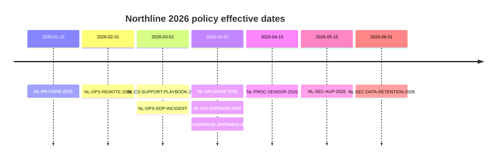

SYNTHETIC

---
id: NL-POLICY-CHANGELOG-2026
title: Policy Changelog 2026
doc_type: changelog
jurisdiction: group
classification: Internal
effective: 2026-06-01
supersedes: none
synthetic: true
---

# Policy Changelog 2026

## Executive summary

This file records which Northline synthetic policies became effective in 2026 and which older synthetic document each one replaced. The 2025 documents referenced below are historical identifiers for retrieval tests and are not part of this delivery set.

## Timeline

## Change register

| New document | Effective | Supersedes | Main change |
|---|---|---|---|
| NL-HR-CODE-2026 | 2026-01-15 | NL-HR-CODE-2025 | speak-up and gifts thresholds refreshed |
| NL-OPS-REMOTE-2026 | 2026-02-01 | none | group hybrid baseline introduced |
| NL-CS-SUPPORT-PLAYBOOK-2026 | 2026-03-01 | NL-CS-SUPPORT-PLAYBOOK-2025 | business-hour SLA clocks and Jira rules clarified |
| NL-OPS-SOP-INCIDENT | 2026-03-01 | NL-OPS-SOP-INCIDENT-2025 | Sev1–3 cadence aligned with Support |
| NL-HR-LEAVE-2026 | 2026-04-01 | NL-HR-LEAVE-2025 | parental top-up and neonatal-care section added |
| NL-FIN-EXPENSE-2026 | 2026-04-01 | NL-FIN-EXPENSE-2025 | caps and approval thresholds updated |
| NL-FIN-EXPENSE-APPENDIX-RATES | 2026-04-01 | NL-FIN-EXPENSE-APPENDIX-RATES-2025 | city hotel and mileage rates updated |
| NL-PROC-VENDOR-2026 | 2026-04-15 | NL-PROC-VENDOR-2025 | risk tiers and payee-document process clarified |
| NL-SEC-AUP-2026 | 2026-05-15 | NL-SEC-AUP-2025 | generative-AI and shadow-AI controls added |
| NL-SEC-DATA-RETENTION-2026 | 2026-06-01 | NL-SEC-DATA-RETENTION-2025 | unified retention schedule added |

## Supersession rule

From a new document's effective date, the new document controls for current policy questions. Historical questions dated before that effective date may require the superseded document. If a rate appendix and main policy conflict, use the document with the later effective date and report the inconsistency to Finance.
