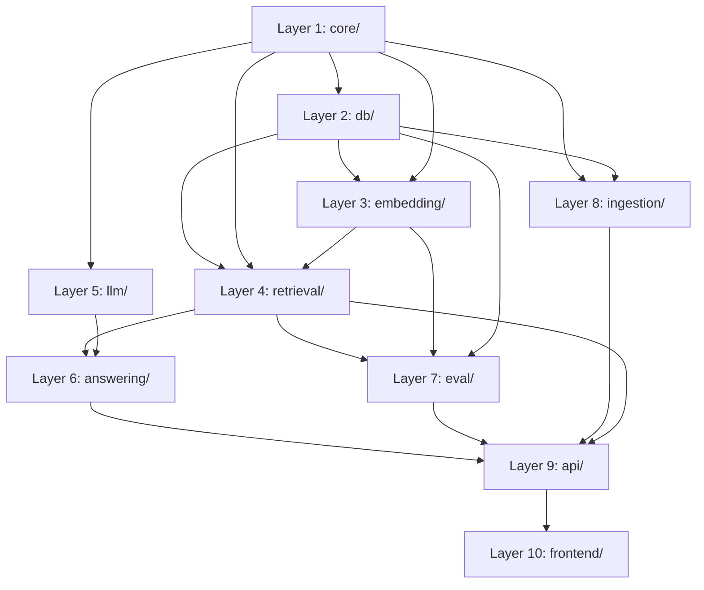

# Extraction Map — RAG_POC_V1 → RAG_MM_MASTER_POC

> Historical/provenance reference generated as an M0 deliverable.
> This file records the original extraction order and donor-to-target mapping plan.
> It should be read as implementation history, not as the primary current-state architecture guide.

Current architecture docs:
- [README.md](/Users/Work/local_dev/RAG%20workflow/RAG_MM_MASTER_POC/README.md)
- [docs/README.md](/Users/Work/local_dev/RAG%20workflow/RAG_MM_MASTER_POC/docs/README.md)
- [docs/architecture_overview.md](/Users/Work/local_dev/RAG%20workflow/RAG_MM_MASTER_POC/docs/architecture_overview.md)
- [docs/module_map.md](/Users/Work/local_dev/RAG%20workflow/RAG_MM_MASTER_POC/docs/module_map.md)

## Extraction Order

The master plan (§M0, §18) mandates: **core first, ingestion later, UI last.**

The order below follows dependency chains — each layer depends only on layers above it.

```
Layer 1: core/         (config, logging, flags)          ← no internal deps
Layer 2: db/           (engine, repos, migration)        ← depends on core/
Layer 3: embedding/    (embedder, batch process)         ← depends on core/, db/
Layer 4: retrieval/    (search, hybrid merge, reranker)  ← depends on core/, db/, embedding/
Layer 5: llm/          (client, prompts)                 ← depends on core/
Layer 6: answering/    (ask pipeline)                    ← depends on retrieval/, llm/
Layer 7: eval/         (retrieval eval harness)          ← depends on retrieval/, embedding/, db/
Layer 8: ingestion/    (chunking, normalize, hashing)    ← depends on core/, db/
Layer 9: api/          (endpoints, Pydantic models)      ← depends on all above
Layer 10: frontend/    (HTML/JS UI)                      ← depends on api/
```

> **Rule:** A layer may only be extracted/modified after all layers it depends on are stable in the new repo.

---

## Dependency Diagram



---

## Path Mapping: Old → New

| Old Path (donor) | New Target Path | Action |
|---|---|---|
| `core/config.py` | `app/core/config.py` | Copy + extend |
| `core/logging.py` | `app/core/logging.py` | Copy + rename logger |
| — | `app/core/flags.py` | NEW file (feature flags) |
| `db/db.py` | `app/db/db.py` | Copy |
| `db/repo_search.py` | `app/db/repo_search.py` | Copy + adapt schema refs |
| `db/repo_documents.py` | `app/db/repo_sources.py` | Rename + restructure |
| `db/repo_chunks.py` | `app/db/repo_chunks.py` | Copy + extend columns |
| `db/repo_embeddings.py` | `app/db/repo_chunks.py` (merge) | Extract `_pgvector_literal`; merge embedding ops |
| `db/migrate.py` | `app/db/migrate.py` | Rewrite for new schema |
| `db/verify_db.py` | `app/db/verify_db.py` | Copy + update checks |
| — | `app/db/schema.sql` | NEW file (new schema) |
| — | `app/db/repo_sources.py` | NEW (replaces repo_documents) |
| — | `app/db/repo_source_parts.py` | NEW |
| — | `app/db/repo_jobs.py` | NEW |
| `embedding/embedder.py` | `app/embedding/embedder.py` | Copy |
| `embedding/process.py` | `app/embedding/process.py` | Copy + adapt |
| `retrieval/search.py` | `app/core_rag/retrieval.py` | Copy + add mode stubs |
| `retrieval/reranker.py` | `app/core_rag/reranker.py` | Copy |
| — | `app/core_rag/candidate_fuser.py` | NEW (M16) |
| — | `app/core_rag/query_router.py` | NEW (M17) |
| — | `app/core_rag/citations.py` | NEW |
| `llm/client.py` | `app/llm/client.py` | Copy |
| `llm/prompts.py` | `app/llm/prompts.py` | Copy + generalize |
| `answering/ask.py` | `app/core_rag/answering.py` | Copy + adapt imports |
| `eval/retrieval_eval.py` | `app/eval/retrieval_eval.py` | Copy + extend modes |
| — | `app/eval/enriched_eval.py` | NEW (M19) |
| — | `app/eval/compare_eval.py` | NEW (M20) |
| `chunking/splitter.py` | `app/ingestion/chunking.py` | Extract logic; replace heading heuristics |
| `chunking/process.py` | `app/ingestion/chunking.py` (merge) | Extract pattern |
| `ingestion/hashing.py` | `app/ingestion/` or utility | Copy |
| `ingestion/normalize.py` | `app/ingestion/normalize.py` | Copy |
| `ingestion/parsers.py` | `app/adapters/pdf/`, `docx/`, etc. | Reference only |
| `ingestion/file_walker.py` | — (removed) | Not needed |
| `ingestion/ingest.py` | `app/ingestion/jobs.py` | Reference only |
| `api/health.py` | `app/api/health.py` | Copy |
| `api/search.py` | `app/api/search.py` | Rewrite models |
| `api/ask.py` | `app/api/ask.py` | Rewrite models |
| — | `app/api/upload.py` | NEW (M4) |
| — | `app/api/corpus.py` | NEW (M4) |
| — | `app/api/compare.py` | NEW (M18) |
| — | `app/api/admin.py` | NEW (M21) |
| `main.py` | `app/main.py` | Rewrite |
| `frontend/index.html` | `frontend/index.html` | Rewrite |
| `frontend/app.js` | `frontend/` | Rewrite |

---

## Milestone Extraction Alignment

| Milestone | Layers Extracted | Key Files |
|---|---|---|
| **M2** (Extract shared core) | 1–7 | config, logging, db, embedding, retrieval, reranker, llm, answering, eval |
| **M3** (Schema redesign) | 2 (rewrite) | schema.sql, migrate.py, verify_db.py, repo_sources.py, repo_source_parts.py |
| **M4** (Upload pipeline) | 8–9 (partial) | jobs.py, upload.py, corpus.py |
| **M5** (Multi-format parsers) | 8 | adapters/pdf/, docx/, pptx/, xlsx/, email/ |
| **M6** (Source-aware chunking) | 8 | chunking.py |
| **M7** (Embeddings) | 3 | embedder.py, process.py |
| **M8** (Retrieval API) | 4, 9 | retrieval.py, search.py endpoint |
| **M9** (Answer API) | 5, 6, 9 | answering.py, ask.py endpoint |
| **M10** (Web UI) | 10 | frontend/ |
